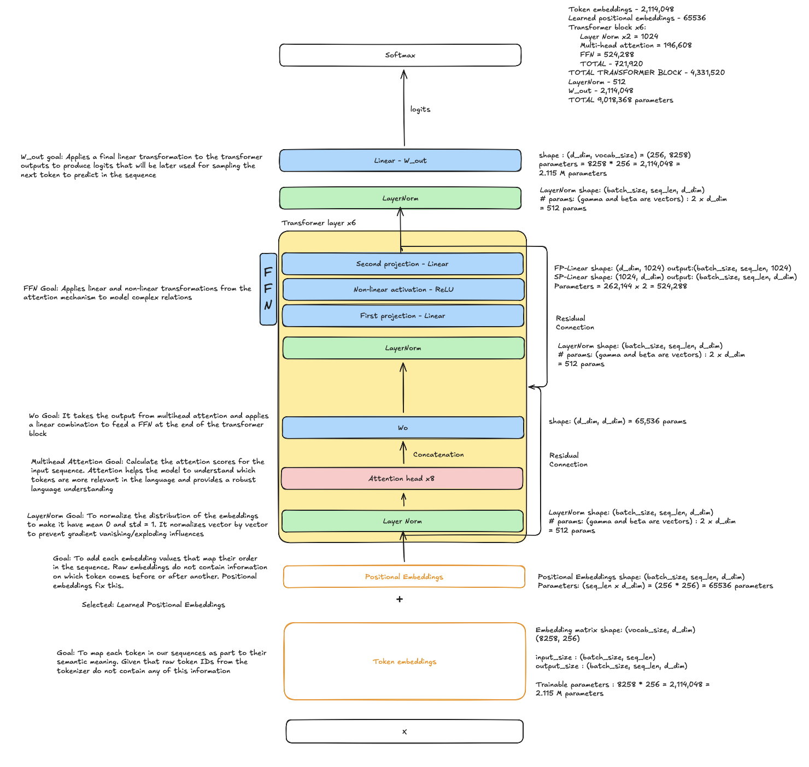
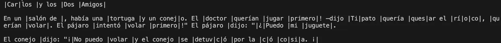
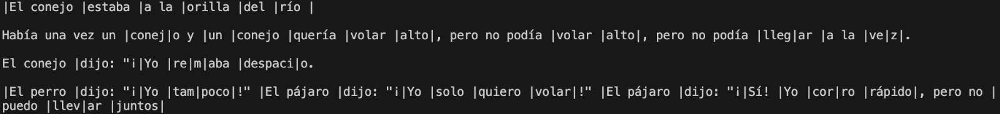
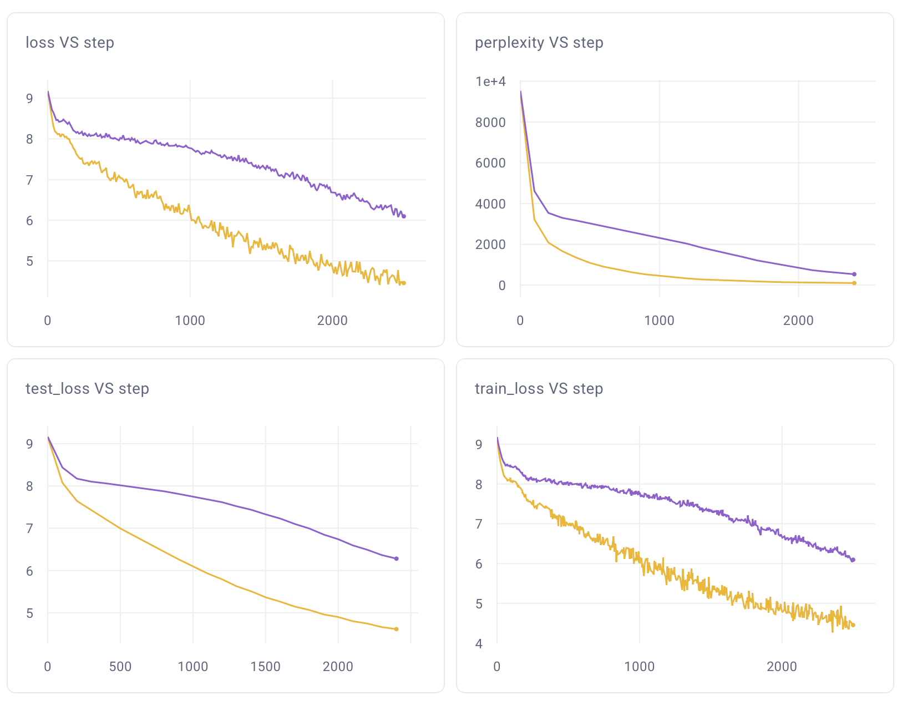
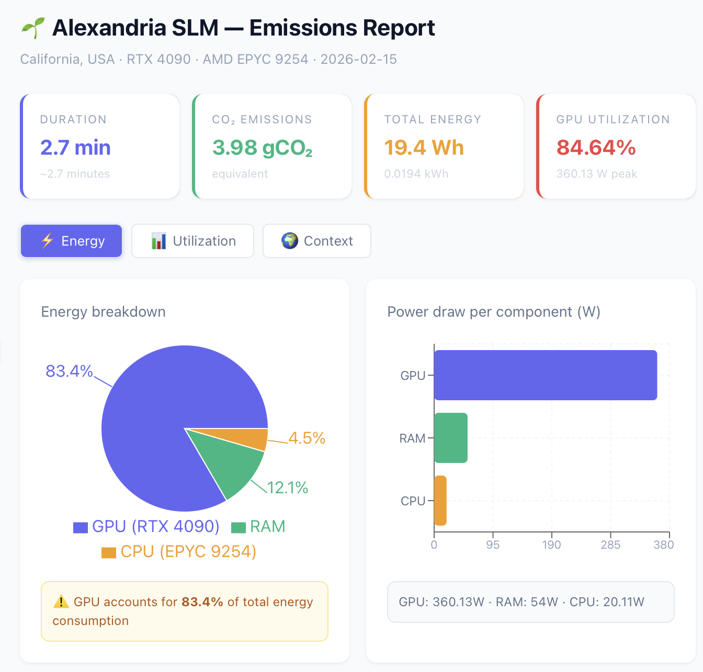
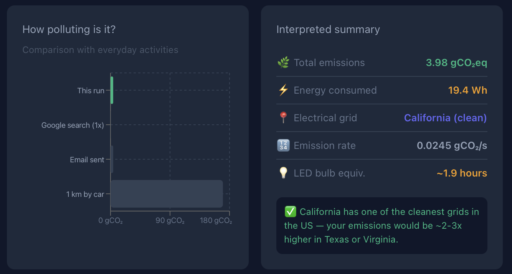

# Alexandria's model card

This document discusses the design choices for the model's architecture.

## Relevant sources
As part of the design process some relevant papers have been analyzed. Even though not all the lessons have been applied they are still an incredible reference for future decisions.

- [Attention is all you need](https://arxiv.org/pdf/1706.03762)
- [Training compute-optimal Large Language Models](https://arxiv.org/pdf/2203.15556)
- [Scaling laws for neural language models](https://arxiv.org/pdf/2001.08361)
- [TinyStories: How small can language models be and still speak coherent English?](https://arxiv.org/pdf/2305.07759)

## Disclaimer about Alexandria versions

Two different versions of Alexandria were trained on this project. Both versions follow the exact same architecture and design decisions. However, Alexandria 1 was trained on [tiny-coop-es](https://huggingface.co/datasets/hetline/tiny-coop-es) dataset tokenized with Tokenizer V1. 
On the other hand, Alexandria 1.1 has been trained with the same dataset tokenized with Tokenizer V2.
Further details on the differences on each tokenizer must be consulted in 'Tokenizer Design Choices' document.

A final performance comparison between Alexandria 1 and Alexandria 1.1 will be discussed at the end of this model card.

## Model Architecture

Alexandria is implemented as a decoder-only transformer model. It is primarily based on the original architecture presented in [Attention is all you need](https://arxiv.org/pdf/1706.03762). However, also some other design choices were made specifically to the goals for Alexandria.

### Architecture Diagram

The diagram has been built using Excalidraw.

- Total parameters: ≈ 9M
- Transformer layers: 6
- Attention heads per transformer layer: 8
- Context window size: 256

The decision to make the model of a size of 9M parameters relies in the next ideas:
- Empirically, we can see learned language patterns with architectures with more than 5M-10M parameters, this idea was also demonstrated in [Tiny Stories: How small can language models be and still speak coherent English?](https://arxiv.org/pdf/2305.07759)
- As discussed in [Training compute-optimal Large Language Models](https://arxiv.org/pdf/2203.15556) it is expected to train a compute-optimal model by training on 20B per 1B parameters. However, Alexandria's size is considerably smaller than that. Hence, I decided to have an aproxximately 1:1 relation in number of parameters and tokens.
- Alexandria's Tokenizer has an observed fertility of 0.89 for V1 and 1.07 for V2. Hence, to build a training dataset with 9M tokens I'd need to process around 10M raw tokens. The current implementation might take 30 minutes to tokenize that amount of data.

Let's remember that Tokenizer V1 produces 9M training tokens for the model, and the tokenizer V2 produces 12M tokens on the same dataset. 
The **training compute costs will take the 12M tokens as basis** to calculate worst cases.

### Context window

Alexandria has a 256-tokens context window. And considering the word fertility that its tokenizer presents, it means that Alexandria would be able to take around 239 words in Spanish as input prompts. This length is designed to fit small stories and fables that Alexandria can complete effectively. Bigger texts are not suitable to manage with Alexandria.

### Positional Embeddings

For this version, it's been decided to use learnable positional embeddings, fixed with the context window of 256 tokens. This approach has been chosen given the simplicity of the methodology, also considering the presence of enough tokens in the training dataset to perform well-learned positional representations. 

Learning the positional representations is preferred given the specific use case Alexandria is trained on, also inspired by the practical results observed in architectures such as GPT-2.

### Multi-head attention

As part of the exercise to work with transformers, I decided to implement multi-head attention with 8 attention heads, each with a d_head of 32. It is known that each head compresses relevant information and nuances to learn the language effectively. Given that Spanish might present more complex nuances that English I decided to use 8 heads.
I decided to implement myself the attention matrix-multiplications instead of using prebuilt Pytorch classes such as MultiheadAttention. This is due to the nature of Alexandria, as this is a project mainly made to learn and deep dive in language modeling and transformer mechanisms, to build better understanding on the foundations.

### Causal and Padding masks

To force the autoregressive nature in this model we need to apply causal masking. Alexandria also has a context window of 256 tokens with a special token for padding with ID 258. During training a padding mask is also applied with the causal mask to avoid computations of padding values. The current implementation takes advantage of the broadcasting capabilities present in Pytorch.

The current implementation might produce rows in our tensors that are completely ignored. But I encountered this causes a problem during backpropagation and propagates **nan** values to the model's parameters. To prevent this situation I double-check the values of the batch after applying both masks and if a row is setted with **-inf** values at all its elements, then values will change to zero. 

## Known biases

Alexandria has been trained on Spanish fables, with diverse narrative setups centered in cooperation. This was intentionally designed this way, as a variation of the approach presented in [Tiny Stories: How small can language models be and still speak coherent English?](https://arxiv.org/pdf/2305.07759)
However, this also introduces narrative biases in Alexandria. The model will present a tendency on completing every prompt in a fable-like style, making it unsuitable for other kind of tasks (at least without post-training).

### Alexandria's world understanding : Everything wants to fly 🪽

Considering this, it's also been identified certain preferences of the model in the vocabulary used when generating text. 
Some examples of generated text show that Alexandria has a certain preference/obsession with the concept of "flying". 

In both stories, we can observe that Alexandria tends to talk about flying. Sometimes in context when it has sense, such as talking about birds, but in other occasions, it attributes other characters the ability to fly, even when they are not supposed to do it.
It is specially interesing to note that Alexandria has formed enough contextual knowledge to also talk about actions such as "row" when a "river" is present in the story. However, it returns to talking about flying whenever possible. 

This might be influenced by the dataset. Deep analysis on the synthetic data composition will be performed at future work, however, it is possible that we can find many examples of fables that imply flying during training, producing this narrative bias. 

Future work might consider also further explainability on Alexandria's activations, based on prior work from Anthropic's [Scaling Monosemanticity: Extracting Interpretable Features from Claude 3 Sonnet](https://transformer-circuits.pub/2024/scaling-monosemanticity/index.html#:~:text=For%20instance%2C%20we%20see%20that%20clamping%20the%20Golden%20Gate%20Bridge%20feature%2034M/31164353%20to%2010×%20its%20maximum%20activation%20value%20induces%20thematically%2Drelated%20model%20behavior).

## Performance metrics

The training runs have been tracked with Comet to easily compare results. The discussed model versions here include Alexandria 1 (purple) and 1.1 (yellow).

| Version | Tokenizer | Cross-entropy loss | Loss @ testing | Perplexity |
|--------|--------|------------|------------|------------|
| Alexandria 1 | V1 | 6.096 | 6.28 | 533.6 |
| Alexandria 1.1 | V2 | **4.455** | **4.613** | **100.8** |

### Cross-entropy loss
Loss was computed using cross-entropy, indicating to explicitly ignore the padding token present during training. 
Alexandria 1 was trained with data coming from Tokenizer V1 and Alexandria 1.1 has been trained using data from Tokenizer V2. We can observe loss went lower faster in Alexandria 1.1 since the beggining than Alexandria 1. Reaching a lowest point at the end of the training (after batch 2500).

In both models, we can see test loss is not far away from train loss values, indicating no overfitting is present.

### Perplexity

I decided to use this metric as reference for language model generation, considering it is easy to calculate from cross-entropy loss.
We can observe that Alexandria 1.1 has a lower perplexity by 5x respect to v1. It means Alexandria 1.1 is "doubting" on average between 100 options per token generation, it is a reasonable number considering it might have even more room for improvement on future versions.

### Generation speed

Both versions of the model have shown an average generation speed of 0.03 seconds per token on a Mac Mini M4 and a Macbook Air M1, with a throughput of around 2000 tokens / minute. Noting that Alexandria has a context window of 256 in reality context should be chunked and might degrade final output quality. This plants the seed for future improvements on context window lenght for possible future versions.

### Examples of generation

Alexandria has been implemented considering the **Temperature** parameter for sampling, with a T = 0 Alexandria runs on greedy sampling. 
After some evaluation a T = 0.5 has been set as the sweet-spot for Alexandria's performance. Generating coherent enough text avoiding loops.
Top-p or top-k techniques have not been implemented at this point.

During training a checkpoint was generated each 100 batches. Next examples of generation texts discuss only some checkpoints were interesting observations could be made.

**Alexandria 1**

**Prompt: "El conejo estaba a la orilla del río"**
**Max tokens: 50**

T = 0 - Greedy Approach

|El conejo |estaba |a la |ori|lla |del |río |y un |pájar|o. El |mono |quería |una |niña |quería |volar |y |quería |volar |de |noche|, pero no podía |volar |el |agua |del |perro |quería |volar |y |intentó |volar |y |le |dijo: "|¿Quieres |mi |agua|. El pájaro |intentó |volar |y |dijo: "¡|No |me |mi |agua|. El pájaro |intentó |volar |y |le |dijo: "|¿Quieres |mi |agua|. El pájaro |

T = 0.5 - Stochastic sampling

|El conejo |estaba |a la |ori|lla |del |río |en un |estanque |er|os|o y |su |ra|tones|: |era |y |Lol|a. |Decidieron |competir|. La |cal|le |dijo: "|¿Quieres |mi |pan|"|No, yo |primero|! —dijo |Lila|. "|Yo |te ayud|a, |la tortuga |y dijo: "¡|Qué |agua|! |La |niña |mi |casa |llor|ó. |Tú |frí|o y |respondió: "|."

---

Alexandria 1 shows a better performance with greedy sampling, however, once temperature is higher the stories told by this version have less sense, even though they try to follow the lingüistic form of Spanish. In this case, Alexandria 1.1 shows better generation.

**Alexandria 1.1**

**Prompt: "El conejo estaba a la orilla del río"**
**Max tokens: 50**

T = 0 - Greedy Approach

|El conejo |estaba |a la |orilla |del |río |co|

En un |jardín de |maripos|a y |un |conejo |y un |conej|o y |un |conejo |quería |volar |alto|, pero no podía |lleg|ar |juntos|. El pájaro |podía |volar|, pero no podía |lleg|ar |sol|os|, pero no podía |lleg|ar |sol|os|, pero no podía |lleg|ar |sol|os|, pero no podía |lleg|ar |sol|os|, pero no podía |lleg|ar |sol|os|, pero no podía |lleg|ar |

T = 0.5 - Stochastic sampling

|El conejo |estaba |a la |orilla |del |río |de la escuel|a, había una |flor |grande y |to|nci|t|es. |Un día, |vieron |un |conejo |querían |us|ar el |mismo |tiemp|o. Pero |solo |u|no podía |volar|, pero no podía |lleg|ar |a la |ve|z|, pero no podía |saltar |alto|, pero no podía |volar|, pero |solo |había un |pájaro |intentó |saltar|, pero no |lleg|ar |sol|os|!", dijo el |pájar|o. "¡|Yo |también|!", dijo el |

---
We can see that when temperature is set to 0 the model falls into narrative loops, however, a 0.5 temperature introduces enough diversity to create an interesting story. Alexandria does not generate perfect text, however, it clearly states a rythm on its narratives, introduces several characters, establishes relations that are semantically correct and tries to keep coherence in the text, even though it presents the previously discussed obsession with "flying".

### Evolution of language modeling

Alexandria 1.1 achieves better performance at language modeling and generation that its predecesor Alexandria 1. We can see this not only by observing the final outputs but also the perplexity and cross-entropy loss metrics.

During training, some checkpoints were saved for evaluation purposes. Here, I discuss the evolution of the language comprehension shown by the model at 3 different stages.

**Prompt: "La tor"**

Let's use a prompt with an incomplete word to measure language understading of the model

**Checkpoint at the beginning of the training**

The text generated at this stage is absolutely random, no sense can be extracted from the story, the language generalization is non existent.

---

|La |tor|do

En un |tenía el |amiga|asinti|.
Foreshadowing: |zana |ó. El niño |hubiera |! —dijo un |El agua |0)*|pájaro. |señor |sano |: el |. Lo |alas |(249 palabras)|malo se |conejito |Puede |pue|.

—Mira, |El pollito |).
- Conflicto: |ó |largo |ó. Se |<0xD4>|listo|: un |o.

Foreshadowing: El |Sol |ac|allo |arroz|ó.

**Checkpoint at step 1000**

At this point, we can see the model is unable to complete the prompt "La tor", but the rest of the story presents more coherence. Concepts such as expressing desires, multiple characters and dialogs are a good indicator that the model is learning. At this point, the model is also generating a moral for the story.

---

|La |tor|y el |P|ájar|o en la |Aprendieron |que |Ar|

En un |

En una |Ma|y un |pájaro |quería |. Lolo |querían |us|ó. |Los dos |querían |us|ar el |mismo |tiemp|o.

—¡|Yo quiero |podía |sol|os|. La |li|e|bre |dijo: "¡|Yo quiero |estaba |feliz |dijo: "¡|Yo |también|.

|Moralej|a: |Trabaj|ar juntos |es mejor |si |se |soluci|on|an |

**Final checkpoint**

At the end of training we can see the model attempts to complete the prompt with a title for the story. It keeps the coherence of its ideas and also keeps context of previous information to generate new one (such as talking about a mouse in the story when the title states a mouse is a main character). Also, it is interesting that the model has identified semantic relations such as naming the Sun and the Moon. Alexandria 1.1 generates dialogs with certain coherence as well, even thought it struggles with verb conjugation.

---
|La |tor|a y el |R|a|tón |en el |S|ol|

En una |estación de |

Había una vez una |abeja |quería |col|a.

El |ratón |quería |trabaj|aban |juntos|. La |Luna |dijo: "¡|Yo |también|. |Los dos |se |miraron|. "¡|Yo quiero |jugar |a la |ve|z|. Se |llev|ar |juntos|!" El |sol |voló |alto y |llev|ar la |li|e|bre |dijo: "|Tú |primero, |

## What Alexandria can do (and can't)

✅ Can do:
- Track entities across narrative (mouse at title → mouse at story)
- Understand semantic relationships (Sun/Moon as related entities)
- Generate multi-turn dialogue with action
- Maintain thematic coherence (fables with morals)

❌ Can't do (yet):
- Perfect verb conjugation
- Complex sentence completion
- Consistent tokenization of all words

→ Path forward: Curated synthetic data + larger model to capture better the Spanish nuances

## Carbon emissions

During training, the carbon emissions have been tracked with [codecarbon](https://codecarbon.io). For Alexandria total trainings the emissions are presented in the next visualizations.

